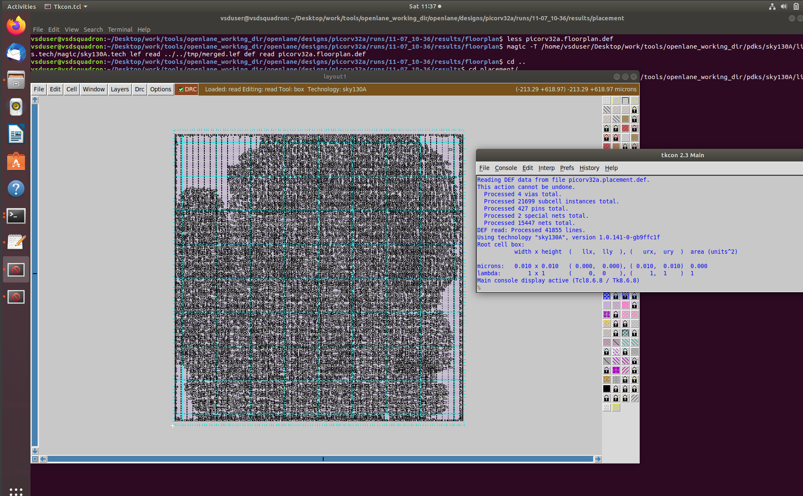

# NASSCOM-VSD-SOC-DESIGN-AND-PLANNING

# Table of Contents
- **Introduction**
- **Day 1 - Synthesis of RTL**
- **Day 2 - Good floorplan and vs Bad floorplan and Itroduction to library cells**
- **Day 3 - Design library cell using Magic Layout and ngspice characterization**

## Introduction
OpenLane is an open-source ASIC (Application-Specific Integrated Circuit) flow that facilitates the design and implementation of digital integrated circuits. It provides a complete RTL-to-GDSII (Register Transfer Level to Graphic Data System II) flow, leveraging various open-source EDA (Electronic Design Automation) tools. Developed by Efabless Corporation, OpenLane aims to lower the barrier to entry for ASIC design by providing accessible, high-quality tools and resources.

Key Features of OpenLane
- *Open-Source Tools Integration:*

OpenLane integrates a variety of open-source EDA tools, creating a cohesive flow for ASIC design. These tools include Yosys for synthesis, OpenROAD for place and route, Magic and KLayout for layout, and Netgen for LVS (Layout vs. Schematic) verification.

- *Customization and Flexibility:*

The flow is highly customizable, allowing designers to tweak parameters and configurations to suit their specific design needs. This flexibility is essential for handling different design constraints and requirements.

- *Community and Collaboration:*

OpenLane benefits from a strong open-source community, providing extensive documentation, support, and continuous improvements. This collaborative approach ensures that the flow stays up-to-date with the latest advancements and best practices in ASIC design.

- *Educational and Research Use:*

OpenLane is widely used in academic and research settings, providing a valuable platform for teaching and experimenting with digital design concepts. Its open nature makes it an excellent tool for learning and innovation.

### Components and Tools in OpenLane

OpenLane integrates several key open-source tools to provide a comprehensive ASIC design flow:

- *Yosys:*

Function: Synthesis

Description: Converts RTL (Verilog) code into a gate-level netlist.

- *OpenROAD:*

Function: Place and Route

Description: Handles the physical placement of cells and the routing of interconnections.

- *Magic:*

Function: Layout Editor

Description: An interactive layout tool used for designing and viewing chip layouts.

- *Netgen:*

Function: LVS (Layout vs. Schematic)

Description: Compares the layout netlist against the schematic netlist to ensure they match.

- *OpenSTA:*

Function: Static Timing Analysis

Description: Performs timing analysis to verify that the design meets timing constraints.

- *Fault:*

Function: Formal Verification

Description: Used for formal verification of designs.

### The OpenLane Flow
The typical flow in OpenLane consists of several stages, each corresponding to a specific phase in the ASIC design process:

- **Synthesis:**

Convert RTL designs into gate-level netlists using Yosys.

- **Floorplanning:**

Define the placement of different blocks and establish the power grid.

- **Placement:**

Place the standard cells in the predefined floorplan using OpenROAD.

- **Clock Tree Synthesis (CTS):**

Design and insert the clock tree to ensure clock signals are distributed efficiently.

- **Routing:**

Route the interconnections between cells and blocks using OpenROAD.

- **Signoff:**

Perform final checks and verifications, including DRC (Design Rule Check) and LVS.

- **GDSII Generation:**

Generate the final GDSII file, which is used for manufacturing the chip.

Below is the representation of the RTL to GDSII flow


## Day 1 - Synthesis of RTL

Aim: we are going to calculate the Flop ratio after the systhesis of RTL of Picorv32a.

### Step 1 - Setting up openlane environment

```
package require openlane 0.9
prep -design picorv32a
```


### Step 2 - Run Synthesis of the RTL

```
run_synthesis
```


### Step 3 - Calculate the flop ratio


Flop ratio = number of d-flipflops / Total number of cells = 1613/14876 = 0.10842969 .

## Day 2 - Good floorplan and vs Bad floorplan and Itroduction to library cells

### Chip floor planning considerations

1. Height and width of core and die

   **core**: The "core" refers to the central part of an integrated circuit (IC) that contains the primary functional elements of the chip, such as the central processing 
  unit (CPU), graphics processing unit (GPU), digital signal processor (DSP), or other specialized processing units.

   **Die**: The "die" is the actual piece of silicon wafer that is cut from the larger wafer during the manufacturing process. It contains the complete integrated circuit, 
  including the core and all peripheral components.

- Utilization factor = Area of the netlist blocks/ total area of core .
- Aspect ratio = Height/width. (of core)

2. Define location of pre-placed cells

   Some of the IPs are placed by the user before automated placement and routing and placement. Hence they are called pre-placed cells.

3. Surround pre-placed cell with decoupling capacitor.

     The state change from a logic '0' to logic '1' requires charge from a voltage source. But, due to the connecting wires
  from the voltage source to the filpflops, there might be voltage drop because of resistance of the wires. If the voltage drop is less than the noise margin, there will no 
  state change. To mitigate this issuse , we make use of decoupling capacitors. These decoupling capacitors are placed near all the sub-blocks.

4. Power planning

     Power planning is a critical aspect of integrated circuit (IC) and system-on-chip (SoC) design that involves creating an efficient power distribution network (PDN) to 
   ensure reliable power delivery to all components of the chip. 

5. Pin placement

    The I/O pins are placed between the boundaries of die and core. The pins are placed in such a way that they are close to the blocks that they feed as input to. The 
  clocks pins are bigger than the normal pins as to provide least resistance path since clocks provide continuous signals throughout the chip function.

6. Logical cells placement blockage

   we make sure to block the pin placement region as to avoid the automated place and route from accessing this region. This is called Logical cells placement blockage.

### Running floorplan

```
run_floorplan
```


### Io log


### Magic layout view


### Library binding and placement

1. Netlist binding

  - We make use of library files to convert our design components to actual blocks. This library file contains a detailed description of the standard cells or components that can be used to design and implement digital circuits.

2. Inital placement
  - we start with initial placement of cells. we make sure that the blocks are placed close to thier respective inputs and outputs.

    
    (Image courtesy: [vlsisystemdesign](https://www.vlsisystemdesign.com/))
    
3. Optimizing placement

 - In some scenarios, the distance between the IO pin and the sub-blocks might be large enough such that it may encounter signal integrity loss. In such secaniors, we place buffers between them . These buffers act as repeaters ensuring that signal integrity is maintained till the signal reaches the sub-blocks from the IO pins. Refer to the below diagram.

  
  (Image courtesy: [vlsisystemdesign](https://www.vlsisystemdesign.com/)) 
   
### Run placement

```
run_placement
```


### Magic tool view after placement



### Zoomed in view


### Cell design and characterization flows

- **Inputs for cell design flow**: Process design kits (PDKs), DRC nad LVS , SPICE models, library and user defined specs.
  
- **Circuit design step**: We design the p-mos--n-mos diagram as per the specifications. we take into consideration sveral 
                       paramters during this step.
  
- **Layout design step**: With help of eular's path devired from the p-mos and n-mos network paths, we draw stick diagrams.
                          We make use of this stick diagram to come up with the layout diagram of the system.

- **Characterization**: We feed parameters obtained from SPICE list of circuits into a Characterization software called GUNA. This software tool provides us with timing characterization, power characterization and noise characterization.

  

  ## Day 3 - Design library cell using Magic Layout and ngspice characterization

  ### IO placer revision

   IO placement can be chnaged by making chnages in the floorplan parameters. This is available in the "floorplan.tcl" file.
  
 - command to view the floorplan.tcl file  
  
```
  cd /Desktop/work/tools/openlane_working_dir/openlane/configuratons/

  cd less floorplan.tcl
  ```


We now change the IO parameter and run floorplan again.


The below picture shows the change in the IO placement


### SPICE deck creation for CMOS inverter

A SPICE deck refers to a file containing the input netlist and commands used by the SPICE simulation program. 

Below is an example of a CMOS invertr spice deck.


(Image courtesy [vlsisystemdesign](https://www.vlsisystemdesign.com))

### Cloning vsdstdcelldesign repository

```
git clone https://github.com/nickson-jose/vsdstdcelldesign.git
```


- The next step is to copy the sky130A.tech from magic tool folder to the newly clones directory.

```
cp /Desktop/work/tools/openlane_working_dir/pdks/sky130A/libs.tech/magic/sky130A.tech /Desktop/work/tools/openlane_working_dir/openlane/vsdstdcelldesign/
```
- This cloned repository contains the library files for a CMOS inverter. We can view the layout using MAGIC tool.

```
magic -T sky130A.tech sky130_inv.mag &
```


### Extracting SPICE list

The next step is to extract the SPICE list of the inverter. By extracting a SPICE netlist from the layout and performing post-layout simulations, designers can ensure that the physical implementation of the circuit meets the required specifications and functions correctly in the real world.

- Use the below commands to extract the spice list.(In tkcon tab)
```
extract all
ext2spice cthresh 0 rthresh 0
ext2spice
```


opening the spice file
```
vim sky130_inv.spice
```


we change certains parametrs and update the spice file as below


- The next step is to run the SPICE file using ngspice tool
  ```
  ngspice sky130_inv.spice
  ```
  


**Characterization**

- Rise Time
  
  The time taken for the output waveform to transition from 20% to 80% of its maximum value.
  
     
  
    Rise time = 2.20409ns - 2.16829ns = **0.0358ns**
  
- Fall time
  
  The time taken for the output waveform to fall from 80% to 20% of its maximum value.
  
     

    Fall time = 4.06644ns - 4.04003ns = **0.02641ns**

- Propagation Delay(cell rise)
  
  The time taken for a 50% transition at the output (0 to 3.3V) corresponding to a 50% transition at the input.
  
    

   Propagation Delay = 2.18659ns - 2.15ns = **0.03659ns**

- Cell Fall delay
  
  

  Cell Fall delay = 4.05327ns - 4.05002ns = **0.00325ns**
  
### Lab introduction to MAGIC tool options and DRC rules.

#### Magic tool

Magic is a widely-used open-source layout editor. Magic is primarily used for creating and editing VLSI circuit layouts, and it provides various features that make it easier for designers to visualize and manipulate the physical design of integrated circuits. 

You can find the documentation here. [magic](http://opencircuitdesign.com/magic)

#### SKY130 PDK

The SkyWater SKY130 process design kit (PDK) is an open-source PDK for the 130nm process technology node from SkyWater Technology. It provides the necessary resources, tools, and files required to design integrated circuits using the SKY130 process

You can find the documentation Here. [sky130 pdk](https://skywater-pdk.readthedocs.io/en/main/) 

We download the necessary files for the lab.
```
wget http://opencircuitdesign.com/open_pdks/archive/drc_tests.tgz
```
We next load one of the magic files from the lab folder to check for DRC violation

Type the below command in terminal from the lab folder
```
magic -d XR met3.mag
```
To check for DRC violation , use the below command in the tkcon window.

```
drc why
```


#### DRC error fixation

- open the ploy.mag file. use the below command in tkcon window

```
load poly
```


- Zoom into the poly.9 region and check for DRC error.


- To mitigate the DRC errors, we change certain definitions in the tech file.

  Open the sky130A.tech file and nagivate to loaction with poly.9

  ```
  vim sky130A.tech
  ```
  
  To search for poly.9 , follow below command

  ```
  Press ESC to enter command mode in vim
  Then type - :/poly.9
  press enter  
  ```

  Now, we change the tech file as below


  

- To load the changed tech file into magic, use the below commans in tkcon window.
  

  ```
  tech load sky130A.tech
  ```
  ```
  drc why
  ```
    

  
  
